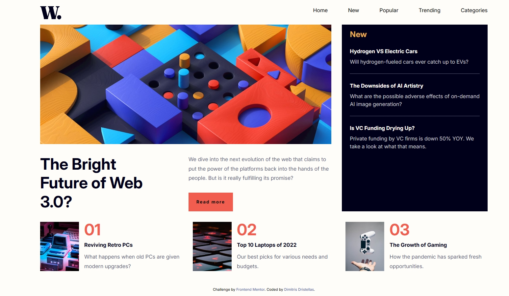

# Frontend Mentor - News homepage solution

This is a solution to the [News homepage challenge on Frontend Mentor](https://www.frontendmentor.io/challenges/news-homepage-H6SWTa1MFl). Frontend Mentor challenges help you improve your coding skills by building realistic projects. 

## Table of contents

- [Overview](#overview)
  - [The challenge](#the-challenge)
  - [Screenshot](#screenshot)
  - [Links](#links)
- [My process](#my-process)
  - [Built with](#built-with)
  - [What I learned](#what-i-learned)

- [Author](#author)


## Overview

### The challenge

Users should be able to:

- View the optimal layout for the interface depending on their device's screen size
- See hover and focus states for all interactive elements on the page

### Screenshot




### Links

- Solution URL: [Add solution URL here](https://github.com/dimitrisdr/news-homepage-main.git)
- Live Site URL: [Add live site URL here](https://dimitrisdr.github.io/news-homepage-main/)

## My process

### Built with

- Semantic HTML5 markup
- CSS custom properties
- Flexbox
- CSS Grid
- Mobile-first workflow

```html
    <nav class="navbar">
      <ul class="nav-items">
        <li class="nav-item"><a href="#" class="nav-link">Home</a></li>
        <li class="nav-item"><a href="#" class="nav-link">New</a></li>
        <li class="nav-item"><a href="#" class="nav-link">Popular</a></li>
        <li class="nav-item"><a href="#" class="nav-link">Trending</a></li>
        <li class="nav-item"><a href="#" class="nav-link">Categories</a></li>
      </ul>
    </nav>
```
```css
    .nav-item {
        opacity: 1;
        position: relative;
    }

    .nav-item::after {
        content: '';
        position: absolute;
        left: 0;
        top: 100%;
        width: 100%;
        height: 2px;
        background-color: var(--Soft-red);
        transform: scale(0.2, 0);
        transform-origin: left;
        transition: transform 0.2s ease-in;
    }

    .nav-item:hover::after{
        transform: scale(1, 1);
    }
```

## Author

- Frontend Mentor - [@yourusername](https://www.frontendmentor.io/profile/dimitrisdr)
